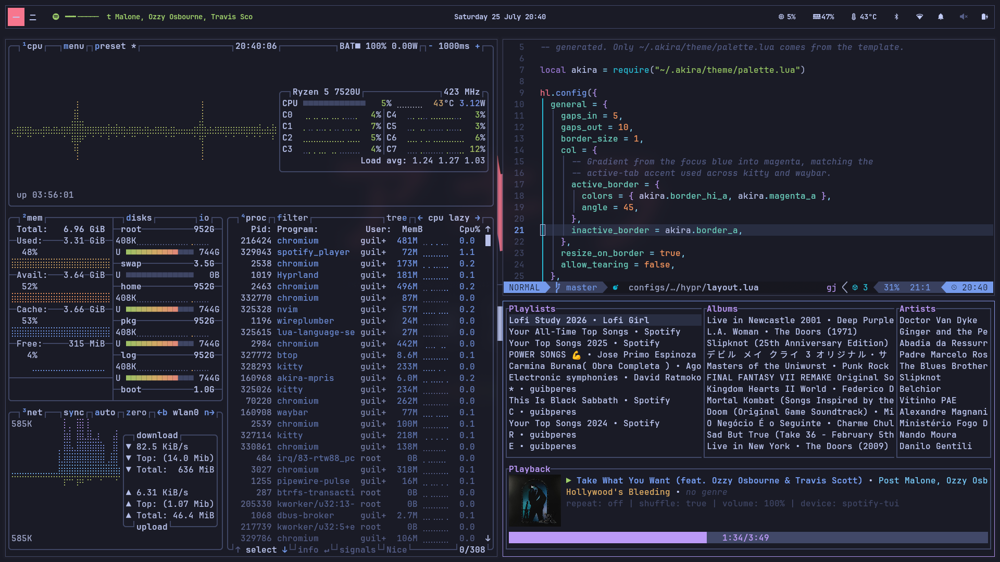
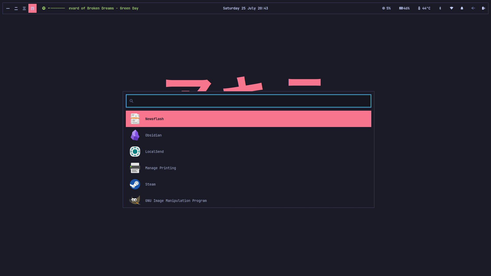
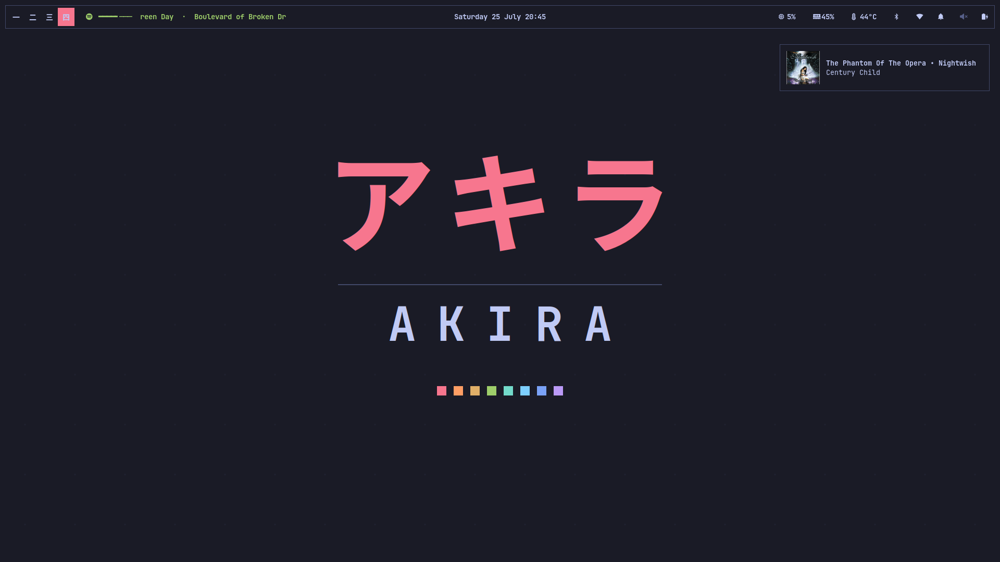
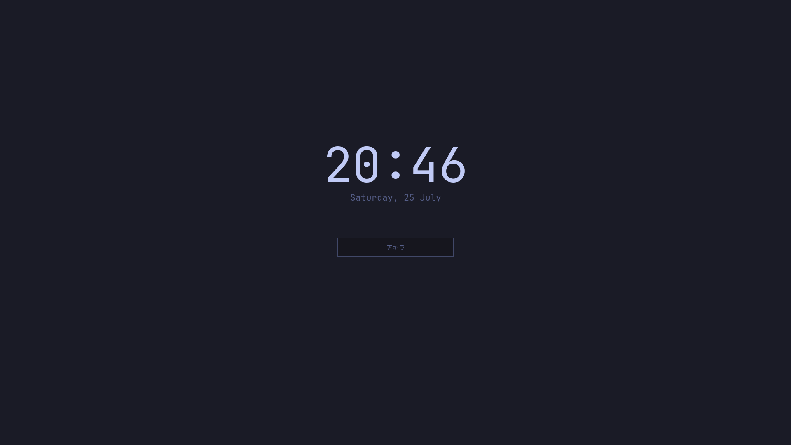

# Akira アキラ






**Akira** is a minimal, keyboard-driven Linux environment built on top of **Arch Linux** and the **Hyprland** compositor. It embodies a philosophy of precision, control, and clarity — inspired by the aesthetics of Tokyo Night and the spirit of the word *Akira* (明), which means *bright*, *clear*, or *intelligent* in Japanese.

### ✨ Vision

Akira aims to deliver a clean and cohesive computing experience focused on:

- **Keyboard efficiency** – Every action is designed to be accessible without leaving the keyboard.
- **Visual clarity** – A refined Tokyo Night-inspired color palette ensures focus and calmness.
- **System coherence** – Every component follows the same minimal aesthetic, from the compositor down to the terminal.
- **Performance and simplicity** – Built on Arch Linux for users who value speed, control, and transparency.

### 🧠 Meaning of “Akira”

> In Japanese, **Akira (明)** means *bright*, *clear*, or *intelligent*.
>
> It represents enlightenment through simplicity — a system that stays out of your way while remaining luminous in design and function.
>
> Just as the light cuts through the dark, Akira seeks to make your workflow sharper, faster, and more focused.

### 🎨 Design Philosophy

The Akira visual identity blends **modern minimalism** with **cyberpunk undertones**:

- JetBrains Mono Nerd Font as the default font for both system and UI.
- A palette based on the Tokyo Night scheme, adapted for contrast and readability.
- **Square corners everywhere.** No rounding in Hyprland, Waybar, wofi, dunst or any TUI border. Sharp edges are part of the identity, not a default left untouched.
- **Red marks what is active.** The active workspace, the active tab, the status bar — one accent, applied consistently, so the eye always knows where it is.
- The kanji **アキラ** stands as the symbolic core — representing clarity in technology and thought.

### 🌈 Color Palette

Every color in Akira is defined once, in `.akira/theme/akira.env`. Nothing below is hardcoded anywhere else.

#### Surfaces

| Role | Hex | RGBA |
| ------ | ------ | ------ |
| **Background** | `#1A1B26` | rgba(26,27,38,1) |
| **Background Dark** | `#16161E` | rgba(22,22,30,1) |
| **Background Alt** | `#1F2335` | rgba(31,35,53,1) |
| **Surface** | `#24283B` | rgba(36,40,59,1) |
| **Highlight** | `#292E42` | rgba(41,46,66,1) |
| **Border** | `#414868` | rgba(65,72,104,1) |
| **Border Focus** | `#7AA2F7` | rgba(122,162,247,1) |

#### Text

| Role | Hex | RGBA |
| ------ | ------ | ------ |
| **Foreground** | `#C0CAF5` | rgba(192,202,245,1) |
| **Foreground Dim** | `#A9B1D6` | rgba(169,177,214,1) |
| **Comment** | `#565F89` | rgba(86,95,137,1) |

#### Accents

| Role | Hex | RGBA |
| ------ | ------ | ------ |
| **Red** | `#F7768E` | rgba(247,118,142,1) |
| **Orange** | `#FF9E64` | rgba(255,158,100,1) |
| **Yellow** | `#E0AF68` | rgba(224,175,104,1) |
| **Green** | `#9ECE6A` | rgba(158,206,106,1) |
| **Teal** | `#73DACA` | rgba(115,218,202,1) |
| **Cyan** | `#7DCFFF` | rgba(125,207,255,1) |
| **Blue** | `#7AA2F7` | rgba(122,162,247,1) |
| **Magenta** | `#BB9AF7` | rgba(187,154,247,1) |
| **Magenta Dark** | `#9D7CD8` | rgba(157,124,216,1) |

A full set of ANSI bright variants is also defined for terminal use. See `.akira/theme/akira.env` for the complete list.

### 🏷️ Semantic Tokens

Colors describe pigment; tokens describe intent. Configs reference tokens wherever possible, so changing the visual identity means editing one block instead of hunting through a dozen files.

| Token | Maps to | Used for |
| ------- | --------- | ---------- |
| `accent` | Red | Active workspace, active tab, status bar |
| `accent_fg` | Background | Text drawn on top of the accent |
| `hover` | Surface | Hover and pointer feedback |
| `ok` | Green | Playing, charging, connected |
| `warn` | Yellow | Low battery, paused, warnings |
| `error` | Red | Critical states and failures |

### 🧩 Theming System

Akira has one palette and one generator. Configuration files are either **templates** that get rendered, or **static files** that reference variables the application already supports.

```txt
.akira/theme/
└── akira.env            # the palette: single source of truth
configs/
├── kitty/               # templates
├── btop/
├── dunst/
├── eilmeldung/
├── spotify-player/
├── hypr/
├── nvim/
├── waybar/              # static, uses @tokens
└── wofi/                # static, uses @tokens
scripts/
└── theme.sh             # renders every *.tmpl found under the roots above
```

Any file ending in `.tmpl` is rendered next to itself with the suffix stripped: `configs/kitty/akira.conf.tmpl` becomes `configs/kitty/akira.conf`. Generated files carry a header saying so and should never be edited by hand.

Whether a file needs templating depends on one thing: **does it contain a literal hex value?** Applications with their own variable system only need their color definitions generated.

| Application | Approach | Why |
| ------------- | ---------- | ----- |
| **Hyprland** | Generated Lua palette | Lua config reads it with `require` |
| **hyprlock** | Static, shared hyprlang colors | `source =` pulls in the generated variables |
| **hyprtoolkit apps** | Static, shared hyprlang colors | One config themes hyprshutdown, hyprlauncher and friends |
| **Waybar** | Static, shared GTK colors | GTK CSS has `@define-color` |
| **wofi** | Static, shared GTK colors | Same color file as Waybar |
| **kitty** | Full template | No variable support |
| **btop** | Full template | No variable support |
| **dunst** | Full template | No includes, no variables |
| **spotify-player** | Full template | Theme file is standalone |
| **eilmeldung** | Full template | Theme lives inside `config.toml` |
| **Neovim** | Generated Lua palette | Loaded at runtime by the colorscheme |

A few notes on the edges of the system. Hyprland moved to Lua configs in 0.55, while the rest of the Hypr ecosystem still runs on hyprlang — where `#` starts a comment, so colors are emitted as `rgba(1a1b26ff)` from automatically derived variants. Graphical utilities such as hyprshutdown and hyprlauncher are themed through `~/.config/hypr/hyprtoolkit.conf`, a single file covering every app built on the toolkit; it is documented under hyprtoolkit rather than under each application, and does not exist until you create it. And the Neovim configuration lives in its own repository, [akira-lazyvim](https://github.com/guibperes/akira-lazyvim), which reads the palette from `~/.akira/theme/palette.lua` and falls back to stock Tokyo Night when Akira is not installed.

### 🔧 Changing a Color

Edit `.akira/theme/akira.env`, then regenerate:

```bash
bash scripts/theme.sh
```

Every dependent file is rewritten. The generator also lints its own output: it fails loudly on hex values left inside a template, and on variables that survived substitution because of a typo.

To render a single tree while iterating:

```bash
AKIRA_TEMPLATE_ROOTS=".akira/theme" bash scripts/theme.sh
```

### 📜 License

This project is distributed under the **MIT License** — feel free to fork, adapt, and build upon Akira.
